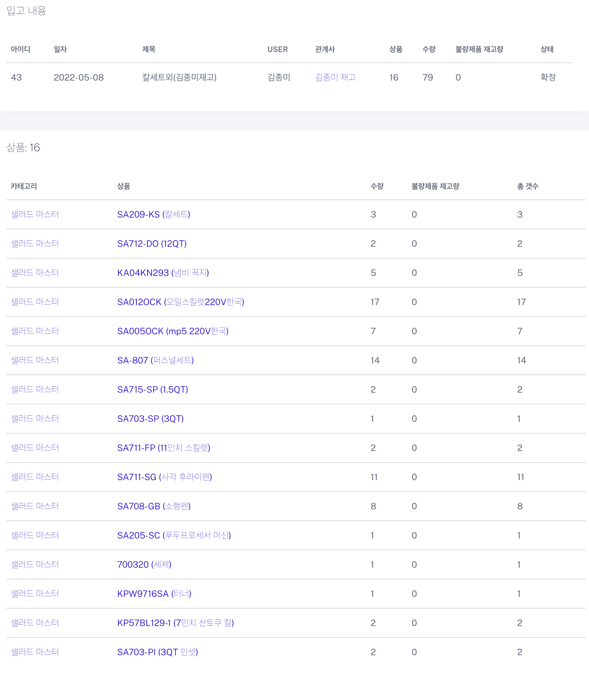

# Web Inventory System
It's a Laravel-based web inventory system. As you can see in the preview and from the ER diagram, it has everything you need: a Dashboard, Transactions, Inventory, Users, and more. Don't be fooled by the appearance; it will provide a robust inventory system.

## Preview

## ER diagram

